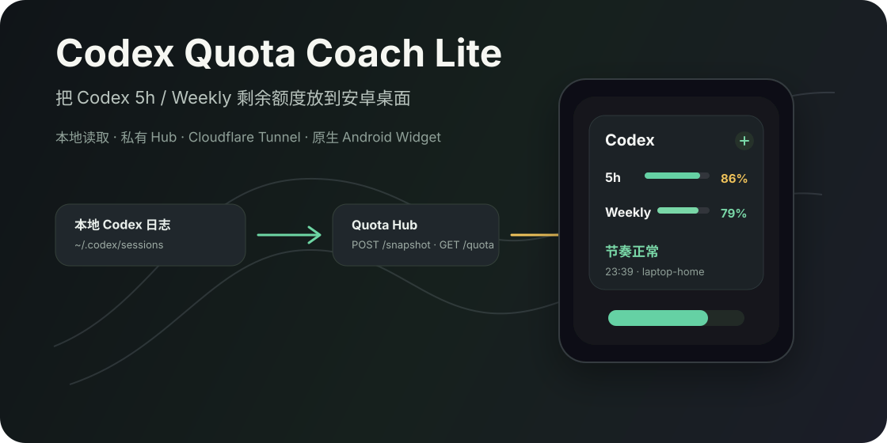
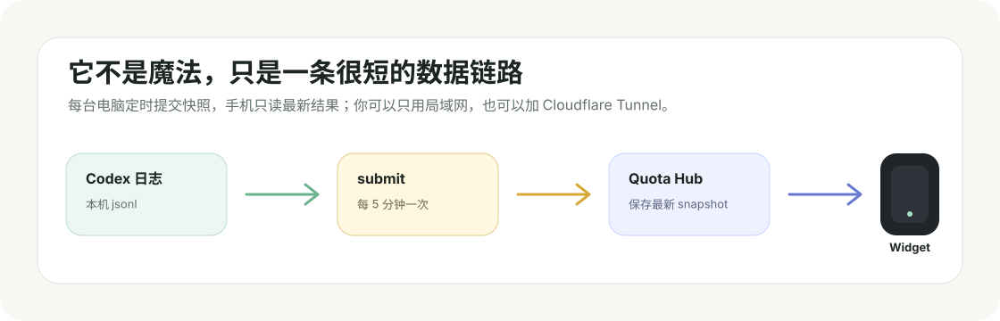

<p align="center">
  
</p>

# Codex Quota Coach Lite

一个给 Codex 重度用户准备的小工具：把 `5h` / `Weekly` 剩余额度放到安卓桌面，顺手提醒你“该多用一点”还是“快用完了”。

你不需要再反复打开 Codex 菜单看额度，也不用记住哪台电脑还有没有刷新。它会从本机 Codex 日志里读出最新 quota，交给一个很小的 Hub，再由 Android Widget 显示出来。

## 它适合谁

- 你已经开通 Codex 会员，希望尽量把额度用满。
- 你经常在手机上看一眼今天还剩多少 `5h` / `Weekly`。
- 你有多台电脑，希望统一汇总到一个手机桌面卡片。
- 你想要一个可自托管、可公网访问、但不依赖 Tasker / KWGT 的方案。

如果你只是想要一个超大的商业 Dashboard，这个项目可能太轻了。它故意只做一件事：**看清 Codex 额度节奏**。

## 最终效果

Android 桌面小组件会显示：

```text
Codex

5h       86%   节奏正常
Weekly   79%   节奏正常

节奏正常
23:39 · laptop-home
```

点一下右上角刷新按钮，就会立即从 Hub 拉取最新 snapshot。后台也会定时刷新。

## 它怎么工作

<p align="center">
  
</p>

项目里有三个核心角色：

| 角色 | 做什么 |
| --- | --- |
| `collector` | 读取 `~/.codex/sessions/*.jsonl` 里的最新 Codex rate limits |
| `Quota Hub` | 保存最新 snapshot，并提供 `GET /quota` 给手机读取 |
| Android Widget | 在桌面显示 `5h` / `Weekly` 剩余额度 |

公网访问时再加一层 Cloudflare Tunnel：

```text
Android Widget
  -> https://quota.example.com/quota
  -> Cloudflare Tunnel
  -> http://127.0.0.1:8765/quota
```

## 3 分钟本地跑起来

先在电脑上收集一次本机 Codex quota：

```bash
python3 -m quota_coach collect
```

启动 Quota Hub：

```bash
python3 -m quota_coach serve --host 0.0.0.0 --port 8765 --store ./data/latest-quota.json
```

另开一个终端，把本机 quota 提交进去：

```bash
python3 -m quota_coach submit --hub-url http://127.0.0.1:8765 --device laptop-home
```

打开浏览器：

```text
http://localhost:8765/quota
```

能看到 JSON，就说明后端链路通了。

## 安卓桌面 Widget

Android App 在 `android/` 目录下。你可以用 Android Studio 打开，也可以命令行构建：

```bash
cd android
./gradlew assembleDebug
```

如果你像我一样把 JDK / Android SDK / Gradle 放在项目的 `.tools/` 目录里，也可以用：

```bash
cd android
./build-local.sh
./install-local.sh
```

手机 App 里填写：

```text
Hub URL: http://电脑局域网IP:8765
Bearer Token: 局域网测试可留空
```

公网方案则填写：

```text
Hub URL: https://quota.example.com
Bearer Token: 你的 QUOTA_HUB_TOKEN
```

详细说明见 [docs/android-widget.md](docs/android-widget.md)。

## 推荐公网方案

如果你希望手机在移动网络、公司 Wi-Fi、外出时也能看到额度，推荐：

```text
Cloudflare Tunnel + 自己的域名
```

好处是：

- 不需要家庭公网 IP
- 不需要路由器端口转发
- 自动 HTTPS
- Hub 可以继续只监听 `127.0.0.1:8765`

配置指南见 [docs/cloudflare-tunnel.md](docs/cloudflare-tunnel.md)。

## 后台常驻

长期使用建议交给 `systemd --user`：

| 服务 | 作用 |
| --- | --- |
| `codex-quota-hub.service` | 常驻运行 Quota Hub |
| `codex-quota-cloudflared.service` | 常驻运行 Cloudflare Tunnel |
| `codex-quota-submit.timer` | 每 5 分钟提交一次最新 snapshot |

模板在：

```text
deploy/systemd-user/
```

配置和安装步骤见 [docs/systemd-user.md](docs/systemd-user.md)。

## 安全提醒

如果 Hub 只在局域网里跑，可以先不配置 token。  
如果要公网访问，请一定设置：

```bash
export QUOTA_HUB_TOKEN="$(openssl rand -hex 24)"
```

启用 token 后：

- `GET /quota` 需要 `Authorization: Bearer <token>`
- `GET /` 需要 `Authorization: Bearer <token>`
- `POST /snapshot` 需要 `Authorization: Bearer <token>`
- `GET /health` 保持公开，方便做连通性检查

更多说明见 [SECURITY.md](SECURITY.md)。

## 项目结构

```text
android/                 原生 Android AppWidget 工程
quota_coach/             Python collector、model、Hub、CLI
tests/                   Python 单元测试
examples/                snapshot 示例
scripts/                 本机辅助脚本
deploy/systemd-user/     systemd user 服务模板
docs/                    Android、Cloudflare、systemd 和调研文档
```

## 现在它还很 Lite

已经有：

- `5h` / `Weekly` 剩余额度
- 使用节奏判断
- 原生 Android Widget
- Hub token 保护
- Cloudflare Tunnel 文档
- systemd user 后台模板

暂时不做：

- 多账号登录
- 官方 API 集成
- 任务建议库
- 商业化分析面板
- iOS / Wear OS 客户端

## 开发与测试

Python 测试：

```bash
python3 -B -m unittest discover -s tests
```

Android 构建：

```bash
cd android
./gradlew assembleDebug
```

贡献前可以看 [CONTRIBUTING.md](CONTRIBUTING.md)。

## License

MIT. See [LICENSE](LICENSE).
